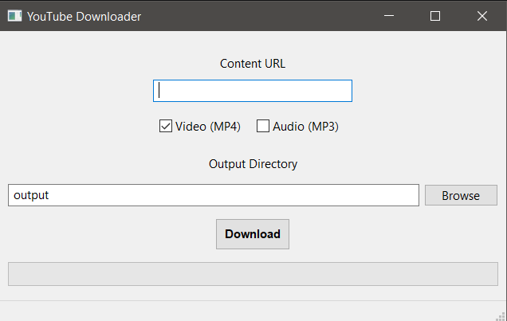

# YouTube Downloader
Simple frontend program that downloads MP4 video content from websites supported by [yt-dlp](https://github.com/yt-dlp/yt-dlp).

You also have the option to download the audio only (MP3).

Form built with WxFormBuilder.
Build with pyinstaller.
